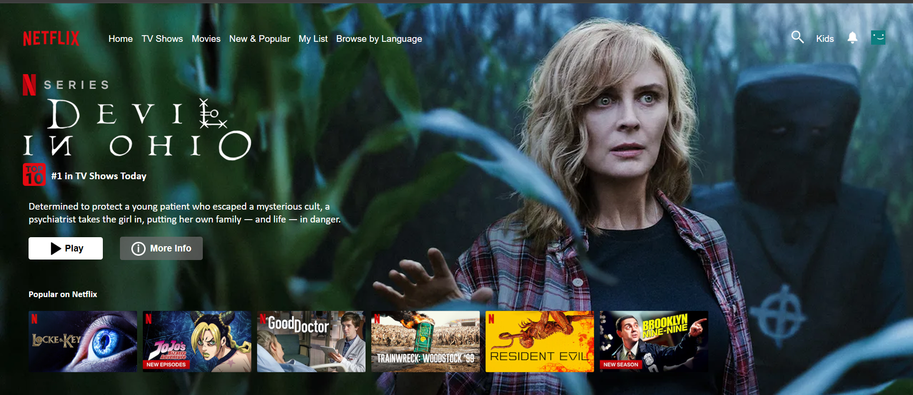

# Netflix Landing Page Clone

## About the Project

This is a front-end recreation of a Netflix landing page clone. The project replicates the visual design and layout of Netflix's main interface, featuring a navigation bar, featured series display, and a recommendation section with popular content.

## Preview



## Project Structure

```
netflix landing page clone/
├── index.html          # Main HTML structure
├── style.css           # Stylesheet and responsive design
├── README.md           # Project documentation
└── images/             # Image assets directory
    ├── logo.png              # Netflix logo image
    ├── background.png        # Hero section background
    ├── nseries.png           # Featured series badge
    ├── title.png             # Series title image
    ├── Top10.png             # Top 10 ranking badge
    ├── play.png              # Play button icon
    ├── info.png              # More info button icon
    ├── search.png            # Search icon
    ├── bell.png              # Notification bell icon
    ├── profile.png           # Profile icon
    └── 1.png to 6.png        # Recommendation thumbnail images
```

## Languages & Technologies

- **HTML5** - Semantic markup and page structure
- **CSS3** - Styling, layout (Flexbox), and responsive design
- **JavaScript** - Interactive functionality (referenced in HTML)

## Key Features

- **Navigation Bar** - Logo, menu items (Home, TV Shows, Movies, etc.), and user controls
- **Featured Series Section** - Hero banner with series title, rating, and description
- **Call-to-Action Buttons** - Play and More Info buttons for user engagement
- **Recommendations Section** - Carousel-style display of popular content
- **Responsive Layout** - Flexbox-based design for flexible arrangement of elements

## File Descriptions

### HTML (index.html)
- Semantic structure with navigation, featured content area, and recommendations
- Image assets integrated for logos, titles, and thumbnails
- Script reference for JavaScript interactivity

### CSS (style.css)
- Global reset (margin, padding, box-sizing)
- Flexbox layouts for responsive navigation and content sections
- Custom styling for buttons, images, and typography
- Background image setup for hero section
- Font families (Helvetica Neue, Calibri)

## Installation & Usage

1. Ensure all image assets are placed in the `images/` folder
2. Open `index.html` in a web browser
3. The page will display the Netflix landing page clone with styled navigation and featured content

## Notes

- Image assets are required for the page to display properly
- The design follows Netflix's UI conventions with dark backgrounds and white text
- Responsive design uses Flexbox for flexible layout across different screen sizes
